# Architecture

**Complete technical architecture of eeshans.com**

---

## Overview

A **static-first monorepo** with React islands, production analytics, and PostgreSQL data warehouse. Built for performance, maintainability, and real-time data analysis.

**Philosophy:** Use existing tools, minimize custom code, optimize for iteration speed.

---

## Tech Stack

### Core Framework

| Component | Technology | Version | Why |
|-----------|-----------|---------|-----|
| Framework | Astro | 4.4.15 | Static-first, React islands, fast builds (1.07s) |
| Styling | Tailwind CSS | 3.4 | Utility-first, no custom CSS needed |
| Interactivity | React | 19 | Islands only where needed (stats, game, comments) |
| Language | TypeScript | 5.4 | Type safety across monorepo |
| Package Manager | pnpm | 10.x | Workspaces, fast, efficient |

### Data & Analytics

| Component | Technology | Purpose |
|-----------|-----------|---------|
| Analytics | PostHog | Event tracking, feature flags, session replay |
| Database | Supabase (Postgres) | Data warehouse, real-time queries |
| API | PostgREST | Auto-generated REST API from PostgreSQL |
| Visualization | Plotly.js | Interactive charts, distributions, dashboards |
| Notebooks | Jupyter | Python analysis with pandas, statsmodels |

### Infrastructure

| Component | Technology | Purpose |
|-----------|-----------|---------|
| Hosting | Fly.io | Docker deployment, global CDN |
| DNS | Cloudflare | Domain management, SSL |
| SSL | Let's Encrypt | Auto-renewing certificates |
| CI/CD | GitHub Actions | Auto-deploy on push to main |
<!-- | Proxy | Cloudflare Worker | PostHog reverse proxy (bypass ad blockers) | -->
---

## Data Pipeline

### How It Works (Beginner-Friendly)

Data flows from user actions to visualizations through a simple pipeline. The key insight: **we don't write backend code**. Instead, we use PostHog for collection and Supabase for storage/querying.


### Two Data Paths

| Path | Speed | Use Case | How It Works |
|------|-------|----------|--------------|
| **Batch Export** | ~1 hour delay | General analytics (pageviews, all events) | PostHog exports hourly → `posthog_batch_events` table |
| **Webhook** | Real-time | App-specific features (leaderboards, live stats) | PostHog webhook → Edge Function → app-specific table |

**Why two paths?** Batch handles volume efficiently. Webhooks enable instant updates for interactive features.

### Key Concepts

| Concept | What It Means |
|---------|---------------|
| **PostgREST** | Auto-generates REST API from your Postgres schema—no backend code needed |
| **SQL Views** | Saved queries that aggregate raw events into useful metrics |
| **Feature Flags** | PostHog controls which variant users see (A/B testing) |

---

## Monorepo Structure

### How It Works (Beginner-Friendly)

The codebase is organized into **three layers**. Code flows from shared → specific:

```mermaid
flowchart TB
    subgraph Shared["📦 packages/shared"]
        A[Layouts]
        B[Components]
        C[Utilities]
    end

    subgraph Site["📄 src/ (Portfolio Site)"]
        D[Pages: /, /about, /writing, /projects]
        E[Blog Posts]
        F[Site Components]
    end

    subgraph Apps["🎮 packages/app-name"]
        G[App Pages]
        H[App Logic]
        I[App Assets]
    end

    Shared --> Site
    Shared --> Apps
    Site --> J["🌐 eeshans.com"]
    Apps --> J
```



### The Three Layers

| Layer | Location | Purpose | Example |
|-------|----------|---------|---------|
| **Shared** | `packages/shared/` | Reusable across all apps | Layouts, ProjectCard, Supabase client |
| **Portfolio Site** | `src/` | Main website | Home, About, Writing, Projects pages |
| **App Packages** | `packages/{app}/` | Standalone apps with own routes | A/B Testing Memory Game at `/ab-simulator/` |

### Why This Structure?

- **DRY**: Write layouts and components once, use everywhere
- **Isolation**: Each app has its own dependencies and build config
- **Scalability**: Adding a new app doesn't touch existing code

### Key Directories

| Directory | What Lives Here |
|-----------|-----------------|
| `packages/shared/src/components/` | Reusable components (ProjectCard, Breadcrumbs, Timeline) |
| `packages/shared/src/data/projects/` | Project YAML files (metadata for each app) |
| `src/pages/` | Portfolio site routes |
| `src/content/post/` | Blog posts (MDX) |
| `packages/{app}/src/pages/` | App routes (mounted at `/{app}/`) |
| `analytics/notebooks/` | Jupyter notebooks for each project |

---

## Database Schema

### How It Works (Beginner-Friendly)

The database has two data pipelines with different update frequencies:


**Real-time webhook** — For app-specific events that need instant updates (e.g., leaderboards)
**Hourly batch export** — For general analytics (pageviews, all events) with slight delay

### Why This Pattern?

**No backend needed.** Instead of writing Python/Node APIs, we:
1. Store raw events in tables
2. Create SQL views that aggregate the data we need
3. Call views/functions directly from JavaScript via PostgREST

PostgREST auto-generates REST endpoints for every table, view, and function. The frontend fetches `/rest/v1/rpc/leaderboard?variant=A&limit_count=10` and gets JSON back.

### Key Concepts

| Concept | What It Means |
|---------|---------------|
| **Generated columns** | Postgres extracts `variant` from JSON automatically—no code needed |
| **Views** | Saved SQL queries that act like virtual tables |
| **RPCs** | Functions you call via REST API (Remote Procedure Calls) |
| **RLS** | Row Level Security—anonymous users can read, only service role can write |
| **PostgREST** | Auto-generates REST API from your Postgres schema |

---

### Shared Infrastructure (All Apps)

These tables, views, and functions are available to all apps. New apps should use these instead of creating duplicates.

**Tables:**

| Table | Update Frequency | Purpose |
|-------|------------------|---------|
| `posthog_batch_events` | Hourly (batch export) | All PostHog events including pageviews, clicks, custom events |
| `likes` | Real-time | Page likes with distinct_id deduplication |
| `analytics_run_log` | On notebook run | Logs from scheduled Jupyter notebook executions |

**Views:**

| View | Purpose |
|------|---------|
| `v_page_views` | Aggregated pageviews by path (total views, unique visitors) |
| `v_project_engagement_stats` | Per-project metrics: total views, 30d views, rank |
| `v_like_counts` | Like counts per path |

**RPCs:**

| Function | Purpose |
|----------|---------|
| `page_views(path_pattern, days)` | Pageview stats with path filtering |
| `project_engagement_stats(project_id)` | Single project's engagement metrics |
| `toggle_like(path, fingerprint)` | Toggle like, return new count |
| `get_likes(path)` | Get like count for path |
| `log_analytics_run(...)` | Log notebook execution |

---

### A/B Simulator Specific

These are specific to the A/B Simulator app. Other apps can follow this pattern.

**Tables:**

| Table | Update Frequency | Purpose |
|-------|------------------|---------|
| `posthog_events` | Real-time (webhook) | Game events: puzzle_started, puzzle_completed, puzzle_failed. Has generated columns for `variant`, `completion_time_seconds`, etc. |
| `experiments` | Manual | A/B test configuration (legacy) |
| `events` | Legacy | Old events table (pre-PostHog) |

**Views:**

| View | Purpose |
|------|---------|
| `v_ab_simulator_stats` | Games played, completion rate, winning variant |
| `v_variant_stats` | Per-variant stats (unique users, avg time, min/max) |
| `v_variant_overview` | Combined stats + A/B comparison as JSON |
| `v_conversion_funnel` | Funnel: Started → Completed → Repeated → Failed |
| `v_ab_completions_geo` | Geo-aggregated completions for map visualization |

**RPCs:**

| Function | Purpose |
|----------|---------|
| `variant_overview()` | Get variant stats + cross-variant comparison |
| `leaderboard(variant, limit)` | Top scores by variant |
| `recent_completions(limit)` | Recent game completions |
| `completion_time_distribution()` | Arrays of completion times per variant |
| `personal_best(variant, username)` | User's best completion time |
| `fn_get_user_percentile(time, variant)` | Calculate user's percentile rank |
| `ab_completions_geo()` | Get geo-aggregated data for maps |

---

### Adding a New App

**Option 1: Use shared infrastructure only (recommended for most apps)**
- All your events automatically land in `posthog_batch_events` via hourly batch export
- Create app-specific views that filter by event name or path
- No new tables needed

**Option 2: Add real-time webhook table (for apps needing instant updates)**
- Create a new table like `your_app_events` with generated columns for your specific properties
- Set up a PostHog webhook → Supabase Edge Function → your table
- Use for features like live leaderboards, real-time dashboards

**Example view for a new app using shared data:**
```sql
CREATE VIEW v_my_app_stats AS
SELECT
  COUNT(*) as total_events,
  COUNT(DISTINCT distinct_id) as unique_users
FROM posthog_batch_events
WHERE event = 'my_app_action'
  AND timestamp > NOW() - INTERVAL '30 days';
```

---

### ER Diagram


---

## Frontend Architecture

### How It Works (Beginner-Friendly)

The frontend is a **monorepo** with three layers. Code flows from shared → site/app-specific:

```mermaid
flowchart TB
    A["📦 packages/shared"]
    B["📄 src/ (Portfolio Site)"]
    C["🎮 packages/ab-simulator"]

    A -->|"layouts, components"| B
    A -->|"layouts, components"| C
    B -->|"routes: /, /about, /writing, /projects"| D["🌐 eeshans.com"]
    C -->|"route: /ab-simulator"| D
```



**Why this structure?**
- **Shared package** — Write once, use everywhere (layouts, components, styles)
- **Portfolio site** — Your main website with pages, blog, about
- **App packages** — Standalone apps that get their own `/app-name/` route

---

### Shared Infrastructure (`packages/shared/`)

Components and utilities that all apps inherit. Import with `@eeshans/shared`.

**Layouts:**

| Layout | Purpose |
|--------|---------|
| `SiteLayout.astro` | Base wrapper with `<html>`, `<head>`, theme, fonts |
| `AppLayout.astro` | App pages with nav bar, breadcrumbs, "Project Docs" link |

**Components:**

| Component | Purpose |
|-----------|---------|
| `Header.astro` | Site navigation with mobile menu |
| `ProjectCard.astro` | Card with status badge, tags, live stats (compact or full) |
| `Timeline.astro` | Project roadmap (in-progress + upcoming) |
| `Breadcrumbs.astro` | Page navigation trail |
| `ConnectionStatus.astro` | PostHog/Supabase health indicator |

**Utilities:**

| File | Purpose |
|------|---------|
| `lib/projects.ts` | Project types, status helpers, getters |
| `data/projectLoader.ts` | Loads all project YAML files |
| `posthog.ts` | PostHog client initialization |
| `supabase.ts` | Supabase client initialization |

**Styles:**
- `styles/app.css` — Base Tailwind styles
- `tailwind.base.js` — Shared Tailwind config (colors, fonts, spacing)

---

### Portfolio Site (`src/`)

The main eeshans.com website. Uses shared components + adds site-specific pages.

**Pages:**

| Route | File | Purpose |
|-------|------|---------|
| `/` | `index.astro` | Home with hero, philosophy, projects, newsletter |
| `/about` | `about.astro` | Bio, experience timeline, recognition |
| `/writing` | `writing/index.astro` | Blog post listing |
| `/writing/[slug]` | `writing/[...slug].astro` | Individual blog post |
| `/projects` | `projects/index.astro` | All projects listing |
| `/projects/ab-simulator` | `projects/ab-simulator.astro` | Project hub page |
| `/contribute` | `contribute/index.astro` | Contribution guide |

**Site-Specific Components:**

| Component | Purpose |
|-----------|---------|
| `Contributors.astro` | Fetches GitHub contributors via API |
| `Comments.astro` | Giscus comments (GitHub Discussions) |
| `WorkTimeline.astro` | Collapsible experience timeline |
| `ImpactShelf.astro` | Recognition cards |
| `PostPreview.astro` | Blog post card |

**Content:**
- `content/post/` — MDX blog posts with Zod-validated frontmatter
- `data/timeline.yaml` — Work experience data
- `data/social-links.yaml` — Social media links

---

### App-Specific (`packages/ab-simulator/`)

Each app is a standalone Astro package with its own route (`/ab-simulator/`).

**Structure:**

```
packages/ab-simulator/
├── src/pages/index.astro    # Main app page
├── public/js/ab-sim/        # Game logic (vanilla JS modules)
│   ├── core.js              # State machine: IDLE → MEMORIZE → HUNT → RESULT
│   ├── analytics.js         # PostHog events + feature flags
│   ├── supabase-api.js      # PostgREST API calls
│   ├── dashboard.js         # Plotly chart rendering
│   ├── leaderboard-ui.js    # DOM updates for leaderboard
│   └── personal-best.js     # localStorage for user's best time
├── astro.config.mjs         # base: '/ab-simulator'
└── package.json             # App-specific dependencies
```

**Game State Machine:**


**Key Files:**

| File | What It Does |
|------|--------------|
| `core.js` | State machine, game loop, DOM caching |
| `analytics.js` | PostHog init, feature flag resolution, event tracking |
| `supabase-api.js` | Wraps PostgREST calls: `leaderboard()`, `variantOverview()`, etc. |
| `dashboard.js` | Plotly charts with adaptive polling (5-60 sec) |

---

### Creating a New App

Run the scaffolding script to create a new app package:

```bash
node scripts/create-package.mjs
```

**What it creates:**

```
packages/your-app/
├── src/pages/index.astro        # App page using AppLayout
├── astro.config.mjs             # Configured with base: '/your-app'
├── tailwind.config.js           # Extends shared config
└── package.json                 # Dependencies + build scripts

src/pages/projects/your-app.astro   # Hub page (project info, links)

packages/shared/src/data/projects/your-app.yaml   # Project metadata

analytics/notebooks/your-app/       # Folder for Jupyter notebooks

src/content/post/your-app-getting-started.md   # Sample blog post
```

**The script handles:**
1. Package scaffolding with correct imports
2. Hub page that pulls from project YAML
3. Project YAML with status, tags, description
4. Notebook folder for analytics
5. Getting-started blog post template

**After running:**
1. `pnpm install` to link the new package
2. `pnpm dev` to start developing
3. Your app is available at `/your-app/`
4. Hub page is at `/projects/your-app/`

---

### How Apps Connect to Shared

Apps import from the shared package using the `@eeshans/shared` alias:

```astro
---
// In packages/ab-simulator/src/pages/index.astro
import AppLayout from '@eeshans/shared/layouts/AppLayout.astro'
import { getProjectById } from '@eeshans/shared/data/projectLoader'

const project = getProjectById('ab-simulator')
---

<AppLayout title={project.name}>
  <!-- Your app content -->
</AppLayout>
```

**Package exports** are defined in `packages/shared/package.json`:
```json
{
  "exports": {
    "./layouts/*": "./src/layouts/*",
    "./components/*": "./src/components/*",
    "./data/*": "./src/data/*",
    "./lib/*": "./src/lib/*"
  }
}
```

---

## Build & Deploy

### How It Works (Beginner-Friendly)

The build process is designed for simplicity: push to main, and the site deploys automatically.

```mermaid
flowchart LR
    A[Push to main] --> B[GitHub Actions]
    B --> C[Docker Build]
    C --> D[Fly.io Deploy]
    D --> E["🌐 eeshans.com"]
```



### Key Concepts

| Concept | What It Means |
|---------|---------------|
| **Static-first** | Astro pre-renders HTML at build time—no server runtime needed |
| **Docker multi-stage** | Stage 1 builds with Node, Stage 2 serves with Nginx (smaller image) |
| **pnpm workspaces** | All packages build together, dependencies shared efficiently |

### Build Pipeline

| Step | What Happens | Time |
|------|--------------|------|
| 1. Trigger | Push to `main` branch | — |
| 2. Install | `pnpm install --frozen-lockfile` | ~30s |
| 3. Build packages | Shared package compiles first | ~5s |
| 4. Build site | Astro builds all pages + apps | ~10s |
| 5. Docker | Multi-stage: Node builder → Nginx | ~15s |
| 6. Deploy | Fly.io updates production | ~30s |

**Total deploy time:** ~90 seconds from push to live

### Local Development

```bash
pnpm dev          # Start dev server (port 3000)
pnpm build        # Production build (test before pushing)
pnpm preview      # Preview production build locally
```

---

## Environment Variables

See `.env.example` for all required variables. Copy it to `.env` to get started:

```bash
cp .env.example .env
```

**Public keys** (safe for client-side): `PUBLIC_POSTHOG_KEY`, `PUBLIC_POSTHOG_HOST`, `PUBLIC_SUPABASE_URL`, `PUBLIC_SUPABASE_ANON_KEY`

**Server-side only**: `GITHUB_TOKEN` (for Contributors component)

---

## Performance

**Lighthouse (Homepage):** 98 Performance, 100 Accessibility, 100 Best Practices, 100 SEO  
**Load times:** ~1.2s FCP, ~1.8s TTI, <50ms TBT  
**Optimizations:** Static-first, React islands, lazy images, Fly.io CDN

---

*Last updated: December 20, 2025*
